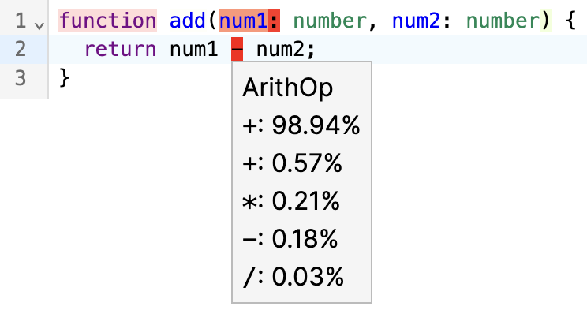

# Dillo

**Dillo** is an exploration into using LLMs to detect bugs in code. Inspired by [AI Found a Bug in My Code](https://joel.tools/codegen/) by Joel Einbinder, Dillo uses the logprobs of each token in a given code snippet to highlight unlikely tokens in code.

    

## Getting Started
While a demo can be found at [dillo.dmo.ooo](https://dillo.dmo.ooo), renting a GPU 24/7 is expensive, so the hosted demo won't always work. If you're interested in playing around with it, feel free reach out and ask me to turn it on, or host it yourself with the following steps.

### Prerequisites

- Node.js
- pnpm
- Instance of [DeepSeek Coder](https://huggingface.co/deepseek-ai/deepseek-coder-7b-base-v1.5)

### Development

1. Clone the repository
1. Run `pnpm install` in the root directory
1. Copy `.env.example` to create a `.env.local` file if it doesn't already exist
1. Run `pnpm run dev`

### Hosting DeepSeek Coder

While I use [RunPod](runpod.io) to host DeekSeek, feel free to self-host or use your own favorite provider. If using RunPod, I've made [this template](https://www.runpod.io/console/explore/oc46pxvlrc) and found that it works well on RunPod's A4500s.
